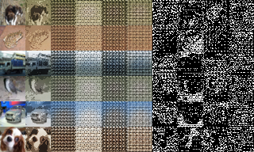
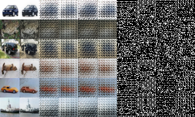
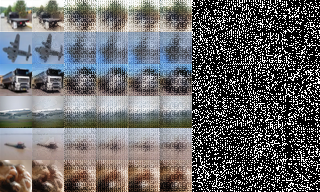
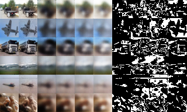

# pixel-cherry-picking
Autoencoding an image into latent variable and discrete mask images.

```
# normal autoencoder
y = self.decoder(self.encoder(x))
loss = (x - y) ** 2
loss = chainer.functions.mean(loss)
```

```
# autoencoder with pixel cherry picking
y = self.decoder(self.encoder(x))
N, _, H, W = y.shape
y = chainer.functions.reshape(y, (N, -1, 3, H, W))
loss = (x[:, None] - y) ** 2
loss = chainer.functions.mean(loss, (2,))
loss = chainer.functions.min(loss, (1,))
loss = chainer.functions.mean(loss)
```

To run: 
```
$ python3 train_model1.py --gpu 0 --batchsize 128 --dim-z 32 --masks 4
```

Tested on: chainer(6.1.0) + cupy-cuda91(6.1.0) + matplotlib(3.0.3) + Python 3.6.5

latent dimensions 4:  


latent dimensions 16:  


latent dimensions 64:  


latent dimensions 64 with output pixels sorted by luminance:  
  
